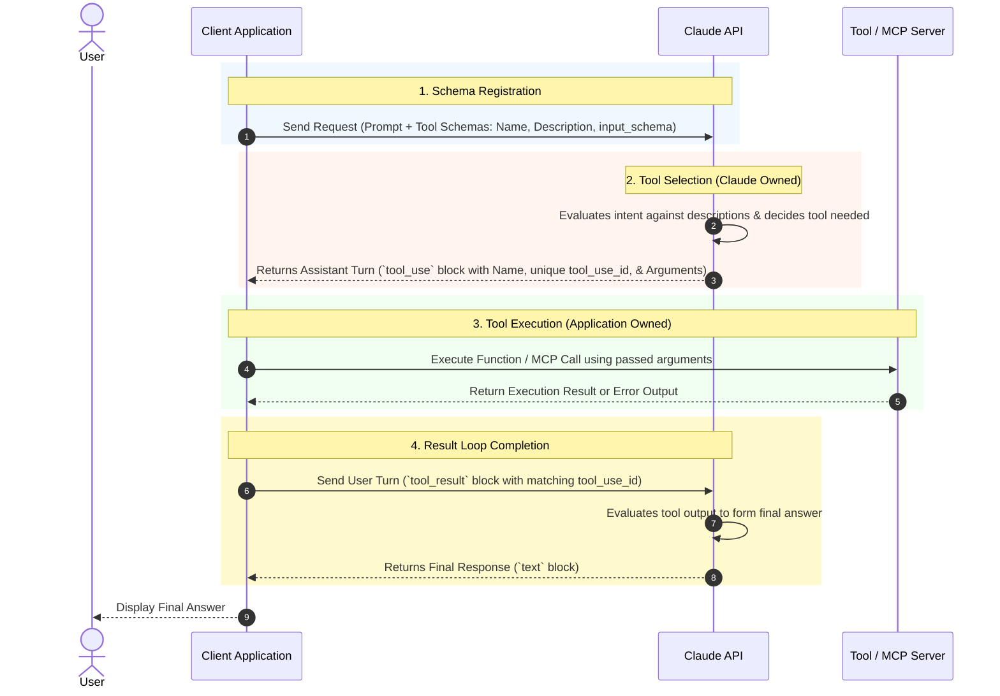

## [Tool Schemas Claude Selects Correctly: Definition, Loop, and Calling Patterns](https://anthropic-partners.skilljar.com/path/claude-certified-developer-foundations/production-grade-prompting-agents-tool-use/486743/scorm/3k33sihfb1tww)

### 1. Problem Statement

Poorly specified tool schemas, ambiguous tool descriptions, improper message block pairing, or unoptimized Model Context Protocol (MCP) tool registrations lead to wrong tool selection, context budget exhaustion, or breaking API validation errors during multi-turn interactions.

---

### 2. Summary

* **Tool Execution Loop & Invariants:** Claude never executes tools directly; it returns a `tool_use` block containing a function name, unique `id`, and input arguments. The client application must execute the tool and return a `tool_result` block in the *immediately following user turn* with a matching `tool_use_id`. Missing or misaligned pairs cause instant API validation failures.
* **Block Array Integrity:** Assistant turns can contain both `text` and `tool_use` blocks. Applications must preserve the full content array (including prose `text` blocks and signed/encrypted `thinking` blocks) when appending to history; dropping `text` blocks corrupts context, while altering `thinking` blocks invalidates cryptographic signatures.
* **Schema Anatomy & Disambiguation:** Tool selection depends heavily on the `description`. Descriptions must contain explicit inclusion and exclusion criteria ("use this when... do not use this when..."). Overlapping schemas should be disambiguated via domain-specific triggers or consolidated into a single tool with a `type` parameter.
* **Parallel Execution Control:** Claude defaults to issuing multiple `tool_use` blocks in a single turn when subtasks are independent. When true subtask dependencies exist, developers must either structure dependent calls as sequential conversation turns or pass `disable_parallel_tool_use: true`.
* **Model Context Protocol (MCP) Integration:** MCP decouples tool definitions and execution into dedicated servers. Using the API MCP Connector requires the `mcp-client-2025-11-20` beta header and supports remote Streamable HTTP servers (not local `stdio` servers). Upfront context costs can be managed via `mcp_toolset` using `defer_loading: true` and tool allowlisting via `enabled`.

---

### 3. Clear & Simple Explanation

In Claude tool-use, Claude operates like a coordinator rather than an execution engine. When you provide tool definitions, Claude reads the names, descriptions, and JSON parameters to choose which tool to call. It outputs a request containing a tool name and a tracking ID. Your code must run the tool and send back the result in the very next turn with that exact same tracking ID.

To ensure Claude picks the right tool every time:

* Write clear descriptions that explain both **when to use** and **when NOT to use** a tool.
* Keep assistant message blocks intact—never strip Claude's prose text or edit its reasoning blocks when building conversation history.
* Mark parameters as `required` only when mandatory, preventing Claude from inventing missing values.
* When using MCP to connect third-party tool servers over HTTP, reduce prompt context overhead by setting `defer_loading` or disabling unused tools.

---

### 4. Real-World Application

**Scenario:** An Enterprise Order Management & Customer Support Assistant that routes queries between a customer database, real-time order tracking, and refund processing while preventing erroneous function calls and context bloating.

**Architecture Flow Diagram:**

```
[ Incoming User Request ]
            │
            ▼
┌────────────────────────────────────────────────────────┐
│  Application Agent Orchestrator                        │
│  - Fetches remote tools via MCP Streamable HTTP        │
│  - Configures `mcp_toolset` (`defer_loading: true`)    │
│  - Passes `mcp-client-2025-11-20` beta header          │
└──────────────────────────┬─────────────────────────────┘
                           │
                           ▼
┌────────────────────────────────────────────────────────┐
│  Anthropic API (Claude)                                │
│  - Evaluates tool descriptions & exclusion rules       │
│  - Generates `tool_use` block (ID: "tool_123")         │
│  - Accompanied by optional `text` block & `thinking`   │
└──────────────────────────┬─────────────────────────────┘
                           │
                           ▼
┌────────────────────────────────────────────────────────┐
│  Client Execution & History Manager                    │
│  - Preserves `text` block + signed `thinking` block     │
│  - Executes remote tool via MCP server                 │
│  - Formats `tool_result` (ID: "tool_123")              │
└──────────────────────────┬─────────────────────────────┘
                           │
                           ▼
┌────────────────────────────────────────────────────────┐
│  Next User Turn Submission                             │
│  - Appends `tool_result` in immediately following turn │
│  - Claude processes result and completes turn          │
└──────────────────────────┬─────────────────────────────┘

```

---

### 5. Key Terms Note Section

### Key Technical Terms

* **tool_use block:** An assistant block containing the tool name, unique call ID, and generated input parameters requested by Claude.
* **tool_result block:** A user block returned in response to a tool call, containing the matching `tool_use_id`, output data, and an optional `is_error` flag.
* **Exclusion Condition:** A prompt engineering rule within a tool description defining explicit scenarios where the model must NOT select the tool.
* **disable_parallel_tool_use:** An API configuration setting forcing Claude to issue at most one tool call per assistant turn.
* **Model Context Protocol (MCP):** An open standard for connecting AI models to external tools, data sources, and servers via structured protocols.
* **mcp_toolset:** An API configuration object used to control tool loading behavior, allowlisting, and defaults for MCP servers.
* **defer_loading:** An MCP configuration option that delays loading full tool schema definitions into the context window until required by the model.
* **Streamable HTTP:** A transport protocol for remote MCP servers using HTTP POST for requests and optional SSE for server-driven events.
* **stdio Transport:** A local MCP transport mechanism where client applications spawn server processes via standard input/output streams.

---

--- **Exam Practice** ---

1. An engineer observes an API validation error (`invalid_request_error`) during a multi-turn conversation with Claude. Inspection shows that Claude generated an assistant turn containing both a `text` block and two `tool_use` blocks. What implementation defect in the client application caused this validation failure?

* A) The client application preserved Claude's prose `text` block in the conversation history alongside the `tool_use` blocks.
* B) The client passed `disable_parallel_tool_use: false` in the request parameters.
* C) The client appended the user's next text query before submitting matching `tool_result` blocks for both `tool_use` IDs in the immediately following user turn.
* D) The client application failed to execute both tool calls concurrently in parallel.

---

2. A developer is registering two tools with similar functional signatures: `fetch_user_profile` and `fetch_account_billing`. During integration testing, Claude frequently selects `fetch_user_profile` when requested to fetch billing history. What is the most effective schema remediation to eliminate this routing ambiguity?

* A) Add explicit inclusion and exclusion conditions to both tool descriptions specifying exact trigger boundaries and negative usage constraints.
* B) Change all optional properties in `fetch_account_billing` to required fields within the JSON input schema.
* C) Enable `defer_loading` in the tool configuration to force sequential parameter evaluation.
* D) Rename the parameters in both JSON schemas so that property key names do not overlap.

---

3. A systems architect wants to connect a local system monitoring agent to Claude via Model Context Protocol (MCP) using a local `stdio` binary server directly through the Anthropic API MCP Connector. Why will this architecture fail?

* A) Local `stdio` transport requires passing the `mcp-client-2025-11-20` header, which disables command-line process spawning.
* B) The Anthropic API restricts tool schemas to a maximum of 3 parameters when executing over local process streams.
* C) `stdio` servers do not support JSON Schema definitions for input parameters.
* D) The API MCP Connector exclusively supports remote servers using Streamable HTTP transport; local `stdio` servers must be managed client-side via the SDK.

---

4. An enterprise agent connects to an MCP server exposing 40 individual database lookup tools. The initial API requests are experiencing significant prompt token cost and context window bloat before any user interaction occurs. Which configuration setting in the API MCP Connector directly resolves this issue?

* A) Set `disable_parallel_tool_use: true` in the main request payload.
* B) Set `defer_loading: true` within the `default_config` of the `mcp_toolset` configuration object.
* C) Pass `is_error: true` on initial tool list registration calls.
* D) Set `strict: true` on each tool's JSON input schema definition.

---

5. During a multi-turn troubleshooting session with extended thinking enabled, Claude returns a `thinking` block along with a `tool_use` block. To save context tokens on the subsequent turn, the client application truncates the string content inside the `thinking` block before passing it back in the `messages` array. What is the immediate consequence?

* A) Claude proceeds with generation but operates at reduced reasoning depth.
* B) The API automatically replaces the missing reasoning tokens using cached context.
* C) The API rejects the request because the modified thinking block invalidates its internal cryptographic signature.
* D) The tool call executes successfully, but the output `tool_result` is marked with `is_error: true`.

---

--- **Answer Key & Explanations** ---

1. **C** - The API mandates that *every* `tool_use` block in an assistant turn must be matched by a corresponding `tool_result` block carrying the exact same ID in the *immediately following user turn*. Submitting user text or out-of-order turns without the matching `tool_result` blocks violates this invariant and triggers a validation error.
2. **A** - Claude routes tool selection primarily based on tool names and descriptions. When tools have overlapping parameter shapes or domain concepts, writing explicit inclusion rules ("use this when...") and exclusion rules ("do not use this when...") provides clear decision boundaries for tool selection.
3. **D** - The Anthropic API MCP Connector only supports remote servers accessible via HTTP (Streamable HTTP). Local `stdio` servers require local client-side connection management through an SDK or client application (such as Claude Desktop or Claude Code).
4. **B** - Setting `defer_loading: true` inside the `default_config` of `mcp_toolset` delays loading full tool definitions into the context window until the model explicitly determines it needs them, drastically cutting upfront prompt context overhead.
5. **C** - Thinking blocks (including encrypted/redacted thinking blocks) contain cryptographic signatures verifying that reasoning context has not been altered client-side. Modifying, summarizing, or stripping thinking blocks breaks signature verification, causing the API to reject the message.


---
# More on tool_use


**Key Execution Invariants Shown Above:**

* **Claude Does Not Run Tools:** Claude only generates the `tool_use` decision payload containing parameters and a tracking ID (Step 2).
* **Application Ownership:** The client application (or MCP Client) is strictly responsible for invoking the execution boundary (Step 3).
* **Strict Message Block Pairing:** The `tool_result` block in Step 4 must be returned in the *immediately following user turn* with a `tool_use_id` matching Step 2 exactly, or API validation fails.

# Example 

```python
import anthropic
import json

client = anthropic.Anthropic()

model = "claude-sonnet-4-6"

tools = [
    {
        "name": "get_weather",
        "description": "Get the current weather for a given location.",
        "input_schema": {
            "type": "object",
            "properties": {
                "location": {
                    "type": "string",
                    "description": "City and state, e.g. San Francisco, CA",
                }
            },
            "required": ["location"],
        },
    }
]
messages = [{"role": "user", "content": "What's the weather in San Francisco?"}]
print(f"Sending user message to Claude: {json.dumps(messages[-1], indent=2)}")
# Claude replies with a tool_use block naming the tool and its arguments.
response = client.messages.create(
    model=model,
    max_tokens=1024,
    tools=tools,
    # Ask for at most one tool call per turn.
    tool_choice={"type": "auto", "disable_parallel_tool_use": True},
    messages=messages,
)

blocks = [block.model_dump() for block in response.content]
print(f"Claude's response: {json.dumps(blocks, indent=2)}")

tool_use = next(block for block in response.content if block.type == "tool_use")
print(f"Claude called {tool_use.name} with {json.dumps(tool_use.input)}")

# Run the tool, then send the result back in a tool_result block.
weather = "15 degrees Celsius, partly cloudy"  # your weather lookup goes here
messages += [
    {"role": "assistant", "content": response.content},
    {
        "role": "user",
        "content": [
            {"type": "tool_result", "tool_use_id": tool_use.id, "content": weather}
        ],
    },
]

print(f"Sending tool result back to Claude: {json.dumps(messages[-1], indent=2)}")

followup = client.messages.create(
    model=model,
    max_tokens=1024,
    tools=tools,
    tool_choice={"type": "auto", "disable_parallel_tool_use": True},
    messages=messages,
)

# Claude uses the result to answer the original question.
final_text = next(block for block in followup.content if block.type == "text")
print(f"Final response: {final_text.text}")
```

## output
```text

Sending user message to Claude: {
  "role": "user",
  "content": "What's the weather in San Francisco?"
}


Claude's response: [
  {
    "id": "toolu_01SS1Tw7aoattXmLHGJTvbtc",
    "caller": {
      "type": "direct"
    },
    "input": {
      "location": "San Francisco, CA"
    },
    "name": "get_weather",
    "type": "tool_use",
    "toolset_name": null
  }
]

Claude called get_weather with {"location": "San Francisco, CA"}
Sending tool result back to Claude: {
  "role": "user",
  "content": [
    {
      "type": "tool_result",
      "tool_use_id": "toolu_01SS1Tw7aoattXmLHGJTvbtc",
      "content": "15 degrees Celsius, partly cloudy"
    }
  ]
}


Final response: The current weather in San Francisco, CA is **15°C (59°F)** and **partly cloudy**. It's a mild day, so you might want to bring a light jacket if you're heading outside!
```
