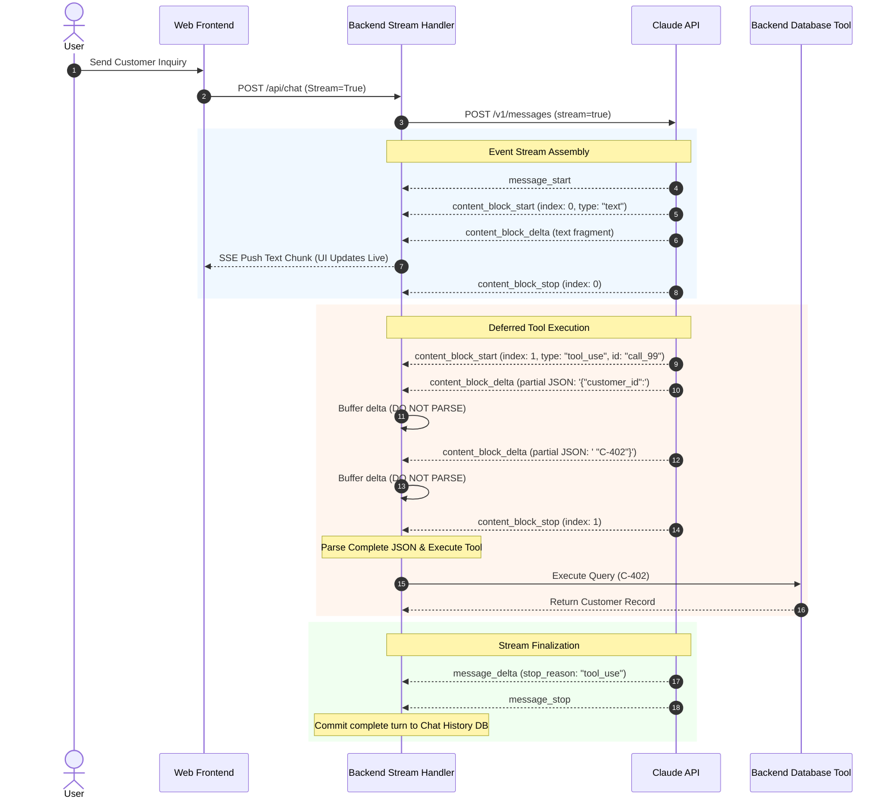

## [Streaming responses and handling partial output without corrupting state](https://anthropic-partners.skilljar.com/path/claude-certified-developer-foundations/production-grade-prompting-agents-tool-use/486743/scorm/3k33sihfb1tww)

### 1. Problem Statement

Waiting for long API responses creates high initial user latency and blank-screen delays. However, adopting response streaming shifts full payload assembly to the client application, introducing severe operational risks—such as executing tools on malformed partial JSON arguments or corrupting multi-turn conversation history with incomplete assistant turns when streams disconnect prematurely.

---

### 2. Summary

* **Streaming Event Lifecycle:** The Claude API delivers streamed responses as a sequential series of Server-Sent Events (SSE) rather than a pre-assembled payload. The client handler processes state changes through six key event types:
  * `message_start`: Initializes the message container and usage tracking shell.
  * `content_block_start`: Declares a new block index and block type (`text`, `tool_use`, or `thinking`).
  * `content_block_delta`: Carries incremental fragments (text strings, partial tool JSON, or thinking tokens).
  * `content_block_stop`: Marks the completion of a specific content block index.
  * `message_delta`: Reports top-level execution updates, including final usage tokens and the `stop_reason`.
  * `message_stop`: Signals total stream completion, confirming the assembled message is finalized.


* **The Block Immutability Rule:** Tool arguments arrive as partial JSON fragments across multiple `content_block_delta` events and are invalid JSON until `content_block_stop` fires. Applications must buffer deltas and defer tool execution or schema parsing until `content_block_stop`.
* **Atomic State Persistence:** Conversation history must only append assistant turns after `message_stop`. Writing a partially streamed turn to state corrupts future requests, as missing or truncated `tool_use` blocks violate API message pairing invariants.
* **Stream Interruption Recovery:** Network drops or client disconnects before `message_stop` require discarding provisional state and retrying the request. Applications must evaluate `stop_reason` (from `message_delta`) to verify whether the turn cleanly completed a tool call (`stop_reason: "tool_use"`) or terminated due to limits/refusals.

---

### 3. Clear & Simple Explanation

Think of non-streamed responses as receiving a fully assembled piece of furniture in a crate, while streamed responses deliver the furniture part-by-part on a conveyor belt.

To manage streaming safely without breaking your system:

* **Wait for the full component before building:** When receiving a tool call, Claude sends the tool's JSON arguments one character fragment at a time. If you try to read or run the tool mid-stream, your code will crash on unclosed brackets or missing fields. Wait until the API fires `content_block_stop` before parsing the JSON.
* **Do not save incomplete conversations:** If the power cuts out (network drop) before the final `message_stop` event arrives, throw away the half-finished response. Saving a broken assistant turn into your database will corrupt the next API call because Claude expects tool requests to be complete and properly formatted.
* **Choose the right tool for the job:** Use streaming for interactive user interfaces to eliminate blank screens. Use standard non-streamed calls for backend batch processing, where no user is waiting and simplicity is preferred.

---

### 4. Real-World Application

**Scenario:** An Enterprise Live Chat Support Agent that streams response prose to the user interface in real time while dynamically buffering internal database lookup tool calls.

**Architecture Workflow:**



---

### 5. Key Terms Note Section

### Key Technical Terms

* **Server-Sent Events (SSE):** A unidirectional streaming protocol over HTTP where the API pushes real-time event updates to the client.
* **content_block_delta:** An event carrying an incremental text, thinking, or JSON argument fragment for a specific block index.
* **content_block_stop:** The event indicating that a specific content block has closed and its accumulated data is complete.
* **message_stop:** The final event in a stream confirming that the entire assistant message is fully generated and sealed.
* **stop_reason:** An API response metadata field inside `message_delta` indicating why model output ended (e.g., `end_turn`, `tool_use`, `max_tokens`).
* **Partial State Corruption:** A bug where incomplete, half-streamed content blocks are written to application memory or database history, breaking subsequent API turns.
* **Delta Buffering:** The client-side technique of accumulating partial string deltas in memory until a block stop event allows safe parsing.
* **Atomic State Commit:** The architectural practice of delaying conversation history persistence until after the stream receives a `message_stop` signal.

---

--- **Exam Practice** ---

1. During a streamed API interaction, a backend service receives multiple `content_block_delta` events containing partial fragments of a `tool_use` argument payload. What is the correct architectural practice for processing these deltas?

* A) Parse the JSON string incrementally on each delta to begin speculative database queries early.
* B) Accumulate the string fragments in memory and attempt JSON deserialization only after receiving `content_block_stop` for that block index.
* C) Forward each delta directly to the tool execution service to reduce pipeline latency.
* D) Execute the tool call immediately upon receiving `content_block_start` using default fallback parameter values.

---

2. A network timeout occurs midway through streaming an assistant turn, cutting off the event stream before a `message_stop` event is received. What is the mandatory error-handling behavior required to maintain agent state integrity?

* A) Save the partially accumulated assistant message to conversation history and append a user clarification turn.
* B) Discard the incomplete assistant turn entirely, execute a retry, and commit to history only after a clean `message_stop` event.
* C) Parse the available `content_block_delta` fragments into a synthetic fallback block and submit to the API.
* D) Pass `stop_reason: "max_tokens"` manually into the payload state to force context continuation.

---

3. Which event in the Claude API streaming lifecycle is responsible for conveying top-level message metadata updates, including the final `stop_reason` and output token usage count?

* A) `content_block_stop`
* B) `message_start`
* C) `message_delta`
* D) `message_stop`

---

4. An engineering team is evaluating whether to implement standard non-streamed calls or streamed responses for a high-throughput backend batch data extraction pipeline. Which statement correctly captures the operational tradeoff?

* A) Non-streamed calls are preferred because they eliminate partial-state assembly complexity and reduce risk when no human user is waiting.
* B) Streaming is required for backend pipelines because it reduces total token pricing by 20%.
* C) Non-streamed calls cannot be used when tools are declared in the request schema.
* D) Streaming should always be forced because it guarantees schema validation before token generation begins.

---

5. When building an agent loop that streams responses, at what precise point should the client application inspect the payload to verify whether Claude intends to execute a tool or complete the conversation?

* A) Immediately upon receiving `message_start` by inspecting the input header fields.
* B) During `content_block_start` by checking if the block type equals `text`.
* C) Upon receiving `message_delta` by evaluating if `stop_reason` equals `"tool_use"`.
* D) After the first `content_block_delta` arrives for block index 0.

---

--- **Answer Key & Explanations** ---

1. **B** - Tool argument inputs arrive as fragmented, partial JSON strings across multiple `content_block_delta` events. These fragments do not form valid JSON until the block is complete; parsing or executing must be deferred until `content_block_stop` is received.
2. **B** - Persisting incomplete or interrupted assistant turns into conversation state violates API structural invariants (such as unmatched `tool_use` IDs). Interrupted turns must be thrown away and retried prior to state persistence.
3. **C** - The `message_delta` event carries top-level changes to the message object, including the `stop_reason` and final token usage tallies.
4. **A** - Non-streamed requests simplify code architecture by delivering complete, fully validated payloads in a single turn. For backend batch jobs where real-time display latency is irrelevant, non-streamed calls eliminate client-side assembly overhead and partial-state risks.
5. **C** - The `stop_reason` field is delivered in `message_delta`. Checking for `stop_reason == "tool_use"` confirms that the model has completed issuing tool requests and that assembled tool blocks are ready to be dispatched.

---
# Example

### 1. Basic Response
```python
import anthropic

# Initialize the Anthropic client (reads ANTHROPIC_API_KEY from your environment variables)
client = anthropic.Anthropic()

model = "claude-sonnet-4-6"

# Create a streaming request using client.messages.create with stream=True
with client.messages.create(
    model=model,
    max_tokens=300,
    messages=[{"role": "user", "content": "Count from 1 to 10."}],
    stream=True,
) as stream:
  print("--- Event Sequence ---")
  for event in stream:
    # Print the type of each event in the exact order received
    print(f"Event Type: {event.type}")

    # Inspect specific delta events where text content arrives
    if event.type == "content_block_delta":
      if event.delta.type == "text_delta":
        print(f"   -> Text chunk: {event.delta.text!r}")
  print("--- Stream Finished ---")

"""
Typical Event Sequence Order

When you run a standard text generation request, Claude sends events in this
specific chronological order:

1. message_start: Signals the start of the overall message object.
2. content_block_start: Indicates the beginning of a content block.
3. content_block_delta: Emitted repeatedly as text fragments are generated.
4. content_block_stop: Marks completion of the current content block.
5. message_delta: Provides final stop reasons and token usage metrics.
6. message_stop: Final event signaling that the stream is fully closed.
"""
```

### Output
```text
--- Event Sequence ---
Event Type: message_start
Event Type: content_block_start
Event Type: content_block_delta
   -> Text chunk: 'Here'
Event Type: content_block_delta
   -> Text chunk: ' is counting from 1 to 10:\n\n1, 2, 3, 4, 5, 6, 7, 8, 9, 10'
Event Type: content_block_stop
Event Type: message_delta
Event Type: message_stop
--- Stream Finished ---
```
---

### 2. with Tool Use. 
```python
import anthropic

client = anthropic.Anthropic()

MODEL = "claude-sonnet-4-6"
MAX_TOKENS = 1024
MESSAGES = [{"role": "user", "content": "What's the weather in Dallas, TX?"}]


# Define the tool schema
TOOLS = [
    {
        "name": "get_weather",
        "description": "Get current weather for a location",
        "input_schema": {
            "type": "object",
            "properties": {
                "location": {
                    "type": "string",
                    "description": "City and state, e.g. San Francisco, CA",
                }
            },
            "required": ["location"],
        },
    }
]


token_count = client.messages.count_tokens(
    model=MODEL,
    tools=TOOLS,
    messages=MESSAGES,
)
print(f"Input Tokens Before Stream: {token_count.input_tokens}")
print("-" * 50)


# Initiate streaming response with stream=True
with client.messages.create(
    model=MODEL,
    max_tokens=MAX_TOKENS,
    tools=TOOLS,
    messages=MESSAGES,
    stream=True,
) as stream:
    for idx, event in enumerate(stream, start=1):
        print(f"[{idx}] Event Type: {event.type}")

        if event.type == "message_start":
            print(f"    Message ID: {event.message.id}")
            print(f"    Input Tokens: {event.message.usage.input_tokens}")

        elif event.type == "content_block_start":
            block = event.content_block
            print(f"    Index: {event.index} | Block Type: {block.type}")
            if block.type == "tool_use":
                print(f"    Tool Name: {block.name} | Tool Call ID: {block.id}")

        elif event.type == "content_block_delta":
            delta = event.delta
            if delta.type == "text_delta":
                print(f"    Text Delta: {repr(delta.text)}")
            elif delta.type == "input_json_delta":
                print(f"    JSON Delta: {repr(delta.partial_json)}")

        elif event.type == "content_block_stop":
            print(f"    Block {event.index} finished.")

        elif event.type == "message_delta":
            print(f"    Stop Reason: {event.delta.stop_reason}")
            print(f"    Output Tokens: {event.usage.output_tokens}")

        elif event.type == "message_stop":
            print("    Stream completed.")

        print("-" * 50)
```

### Output
```text
Input Tokens Before Stream: 584
--------------------------------------------------
[1] Event Type: message_start
    Message ID: msg_011Cee3vLPKGuUE21a7JFcH6
    Input Tokens: 584
--------------------------------------------------
[2] Event Type: content_block_start
    Index: 0 | Block Type: tool_use
    Tool Name: get_weather | Tool Call ID: toolu_016MCS7U7TpQnR6mvfneTKwu
--------------------------------------------------
[3] Event Type: content_block_delta
    JSON Delta: ''
--------------------------------------------------
[4] Event Type: content_block_delta
    JSON Delta: '{"'
--------------------------------------------------
[5] Event Type: content_block_delta
    JSON Delta: 'location'
--------------------------------------------------
[6] Event Type: content_block_delta
    JSON Delta: '": "Dallas, '
--------------------------------------------------
[7] Event Type: content_block_delta
    JSON Delta: 'TX"}'
--------------------------------------------------
[8] Event Type: content_block_stop
    Block 0 finished.
--------------------------------------------------
[9] Event Type: message_delta
    Stop Reason: tool_use
    Output Tokens: 56
--------------------------------------------------
[10] Event Type: message_stop
    Stream completed.
--------------------------------------------------
```


### 3. with tool use buffer 
To buffer partial JSON deltas and defer tool execution until `content_block_stop` signals the block is complete, track active streaming blocks by their `index` in a dictionary:

```python
import json
import anthropic

client = anthropic.Anthropic()
model = "claude-sonnet-4-6"

tools = [
    {
        "name": "get_weather",
        "description": "Get current weather for a location",
        "input_schema": {
            "type": "object",
            "properties": {
                "location": {"type": "string"},
                "unit": {"type": "string", "enum": ["celsius", "fahrenheit"]},
            },
            "required": ["location"],
        },
    }
]

# Track partial buffers keyed by content block index
tool_buffers = {}

def execute_tool(tool_name: str, tool_id: str, arguments: dict):
    """Placeholder function called only when JSON is complete and valid."""
    print(f"\n---> [EXECUTING TOOL] '{tool_name}' (ID: {tool_id})")
    print(f"     Parsed Arguments: {arguments}\n")

with client.messages.create(
    model=model,
    max_tokens=1024,
    tools=tools,
    messages=[{"role": "user", "content": "What's the weather like in Austin, TX in fahrenheit?"}],
    stream=True,
) as stream:
    for event in stream:
        # 1. Initialize buffer when a tool_use block starts
        if event.type == "content_block_start":
            if event.content_block.type == "tool_use":
                tool_buffers[event.index] = {
                    "id": event.content_block.id,
                    "name": event.content_block.name,
                    "raw_json": ""
                }
                print(f"[Block {event.index}] Started tool_use block for: {event.content_block.name}")

        # 2. Accumulate incoming partial JSON strings (DO NOT parse here)
        elif event.type == "content_block_delta":
            if event.index in tool_buffers and event.delta.type == "input_json_delta":
                fragment = event.delta.partial_json
                tool_buffers[event.index]["raw_json"] += fragment
                print(f"[Block {event.index}] Buffered delta fragment: {repr(fragment)}")

        # 3. Parse JSON and execute tool only after block stop fires
        elif event.type == "content_block_stop":
            if event.index in tool_buffers:
                tool_data = tool_buffers.pop(event.index)
                full_json_str = tool_data["raw_json"]
                
                print(f"[Block {event.index}] Block stopped. Complete JSON string: {repr(full_json_str)}")
                
                # Safely parse full JSON string
                try:
                    args = json.loads(full_json_str)
                    execute_tool(tool_data["name"], tool_data["id"], args)
                except json.JSONDecodeError as e:
                    print(f"Error parsing tool JSON: {e}")

```


### Output
```text
[Block 0] Started tool_use block for: get_weather
[Block 0] Buffered delta fragment: ''
[Block 0] Buffered delta fragment: '{"locat'
[Block 0] Buffered delta fragment: 'ion'
[Block 0] Buffered delta fragment: '": "Au'
[Block 0] Buffered delta fragment: 'stin, TX"'
[Block 0] Buffered delta fragment: ', '
[Block 0] Buffered delta fragment: '"unit": "'
[Block 0] Buffered delta fragment: 'fahre'
[Block 0] Buffered delta fragment: 'nheit"}'
[Block 0] Block stopped. Complete JSON string: '{"location": "Austin, TX", "unit": "fahrenheit"}'

---> [EXECUTING TOOL] 'get_weather' (ID: toolu_011Qiwuey3b8dPWMbc5AvCeu)
     Parsed Arguments: {'location': 'Austin, TX', 'unit': 'fahrenheit'}
```

---

**Key Implementation Details**

* **Index Keying:** Use `event.index` to map incoming deltas to the correct tool block. Multiple text blocks or tool calls in a single response will each have a unique block index.
* **String Concatenation:** Append `event.delta.partial_json` string fragments directly into a memory buffer. Attempting `json.loads()` on individual deltas will throw a `JSONDecodeError`.
* **State Cleanup:** Call `.pop(event.index)` on `content_block_stop` to extract the buffer and keep memory clean.
* **Anthropic SDK Alternative:** If direct raw event loop handling isn't strictly required, the SDK's `client.messages.stream()` context manager provides `stream.until_done()` or standard helpers that handle delta aggregation automatically under the hood.
