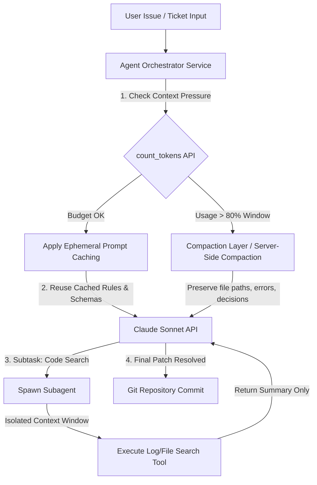

## [Model selection and keeping multi-turn sessions in budget](https://anthropic-partners.skilljar.com/path/claude-certified-developer-foundations/production-grade-prompting-agents-tool-use/486743/scorm/3k33sihfb1tww)

### 1. Problem Statement

In production agentic applications, unexpected context expansion—driven by long conversation histories and large multi-turn tool outputs—rapidly exhausts the model's context window memory. Without upfront context engineering, systems suffer from API validation rejections prior to generation, mid-generation cutoffs (`model_context_window_exceeded`), escalating response latency, and unsustainable token costs.

---

### 2. Summary

* **Model Selection Framework:** The Claude model family (Fable, Opus, Sonnet, Haiku) presents distinct cost, latency, and capability tradeoffs. Sonnet serves as the balanced default for production workloads. Upgrading to higher tiers (Opus, Fable) or downgrading to Haiku must be driven strictly by evaluation set data proving necessity or acceptable quality regression—never by informal testing or premature cost-cutting.
* **Context Ceiling Mechanics:** The Anthropic API does not silently truncate context.
    1. Oversized input payloads trigger an immediate API validation error (`invalid_request_error`) before generation begins.
    2. Requests that fit initially but reach the token ceiling mid-generation return generated tokens with `stop_reason: "model_context_window_exceeded"`.
* **Four Context Budget Strategies:**
    1. **Pruning:** Rewinds the conversation to an earlier turn, discarding intermediate conversation history. Saves space but forces the model to relearn lost information.
    2. **Compaction:** Condenses conversation history into a summary. Available via server-side compaction (beta) or manual client-side summarization. Summarizer prompts must explicitly order the preservation of modified file paths, decisions, and errors/resolutions to avoid task-critical state loss.
    3. **Clearing:** Starts a fresh session context. Best when switching to unrelated tasks; requires persistent external files (e.g., `CLAUDE.md`) to pass cross-session state.
    4. **Subagent Handoffs:** Delegates self-contained subtasks (like deep exploration or log analysis) to isolated subagents with dedicated system prompts and toolsets, returning only summarized findings to the parent agent context window.


* **Optimization & Measurement Levers:**
  1. **Prompt Caching:** Places `cache_control: {"type": "ephemeral"}` breakpoints (up to 4) on static request prefixes (system prompts, tool definitions, reference docs) to dramatically lower input cost and latency across turns.
  2. **Token Counting:** Uses the `count_tokens` endpoint to inspect payload token sizes prior to inference, enabling proactive request gating before hitting API context limits.


* **RAG System Failure Modes & Tradeoffs:** Retrieval pipelines fail at chunking (improper boundary splits), embedding matching (semantic similarity missing exact string identifiers), or prompt assembly. Fetch-once retrieval indexes provide deterministic, inspectable lookups with sync overhead; search-across-rounds agentic file search eliminates index staleness at the expense of higher per-query token consumption.

---

### 3. Clear & Simple Explanation

When building AI agents that run for many steps, the context window acts like the model's working memory buffer. Managing this space effectively requires four key principles:

1. **Pick the Model deliberately:** Start with Sonnet for standard agent tasks. Only upgrade to Opus/Fable if your benchmark evals prove Sonnet fails, and only move down to Haiku if evals confirm quality remains acceptable.
2. **Prevent Budget Blowouts:** In production, tool outputs (like terminal outputs or database queries) are 3x to 5x larger than test data. If your context fills up, the API either rejects the request outright or cuts off the answer mid-sentence.
3. **Use the Right Trimming Strategy:**
* **Pruning:** Rewind time to delete bad branches of conversation.
* **Compaction:** Summarize past chat turns. Always instruct your summarizer *specifically* what to keep (like modified file paths, key decisions, and errors), or it will drop technical details the agent needs.
* **Clearing:** Start completely fresh when switching to an unrelated task.
* **Subagents:** Send complex side-investigations to a separate sub-worker so its chat noise doesn't clutter your main workflow context.


4. **Cache Static Context and Count Tokens:** Use prompt caching on fixed instructions and tool schemas so you don't pay full price on every turn. Use token counting to verify message sizes before sending them to the API.

---

### 4. Real-World Application

**Scenario:** An Enterprise Software Refactoring & Bug Resolution Agent handling long-horizon engineering tasks across large code repositories.

**Architecture Workflow:**



**Implementation Highlights:**

1. **Pre-Flight Inspection:** The orchestrator invokes `count_tokens` before every generation turn. If context usage exceeds 80% of model limits, it triggers a compaction pass that explicitly preserves modified file lists, pending unit tests, and resolved bugs.
2. **Ephemeral Caching:** Static system rules and tool schemas are marked with `cache_control: {"type": "ephemeral"}`, allowing multi-turn tool execution turns to reuse cached prompt tokens at a fraction of the cost.
3. **Subagent Delegation:** Codebase exploration and log analysis subtasks are dispatched to subagents. The subagents execute tools in isolated contexts and return only condensed findings, preventing raw log noise from flooding the main context window.

---

### 5. Key Technical Terms

* **Context Window:** The total token capacity available for a single API request, encompassing system prompts, message history, tool schemas, tool outputs, and generated responses.
* **model_context_window_exceeded:** The API `stop_reason` returned when model generation reaches the context window ceiling partway through output generation.
* **Pruning:** A context management technique that rewinds conversation history to a prior turn, removing subsequent turns to free up context window space.
* **Compaction:** A context reduction method (via server-side compaction or manual client-side summarization) that condenses past conversation turns into a succinct summary block.
* **Subagent Handoff:** An architectural pattern where a main agent delegates a self-contained subtask to a secondary agent operating within its own independent context window.
* **Prompt Caching:** An API capability using `cache_control` with `ephemeral` to store and reuse pre-processed prompt prefixes (such as system prompts and tool schemas) across multi-turn requests.
* **count_tokens Endpoint:** An API diagnostic endpoint that calculates the exact token count of a requested payload without invoking model generation or incurring inference costs.
* **Hybrid Search:** A retrieval architecture combining semantic vector similarity with exact lexical (keyword) search to prevent retrieval failures on specific identifiers or error codes.

---

--- **Exam Practice** ---

1. A production agentic workflow analyzing code repositories experiences unexpected API failures after turn 8. Analysis reveals that terminal command tool outputs are significantly larger than expected, causing request payloads to exceed context limits. What error behavior does the Anthropic Messages API display when an initial request payload exceeds the model's context window ceiling?

* A) The API silently truncates the oldest user and assistant turns to fit the request into the context window.
* B) The API accepts the request but forces model output temperature to zero to minimize completion length.
* C) The API rejects the request immediately with a validation error before generation begins.
* D) The API automatically converts the message history into a compressed summary block before processing.

---

2. An engineering team implements client-side manual compaction for a long-running software refactoring agent. After compaction runs, the agent frequently breaks by attempting to re-edit files it already modified or re-running fixed bug tests. What is the root cause of this failure?

* A) The summarizer prompt was loosely specified as "summarize the conversation," causing it to drop critical technical state like modified file paths and resolved errors.
* B) The client application failed to pass `cache_control: {"type": "ephemeral"}` during the compaction call.
* C) Server-side compaction was not enabled via the `count_tokens` endpoint.
* D) Manual compaction automatically resets model extended thinking signatures, causing tool execution rejection.

---

3. A principal system architect needs to optimize token costs and request latency for a multi-turn customer support agent that utilizes a 5,000-token system prompt and 12 complex tool definitions. Which API feature provides the highest-leverage cost reduction across turns?

* A) Specifying `stop_reason: "model_context_window_exceeded"` on all user turns.
* B) Decreasing the model context window limit via the `count_tokens` endpoint payload.
* C) Replacing tool schemas with unstructured text prompts in every user message turn.
* D) Placing `cache_control` with `type: "ephemeral"` on the system prompt and tool schema prefix.

---

4. An enterprise RAG system querying a reference repository of technical API specifications frequently returns incorrect answers because semantic embedding matches fail to retrieve chunks containing specific error code string identifiers (e.g., `ERR_SYS_409`). Which architectural modification directly resolves this retrieval failure?

* A) Increasing the context window size of the generation model to maximum capacity.
* B) Implementing a hybrid search path that runs lexical keyword matching alongside semantic vector search.
* C) Switching from Sonnet to Haiku for embedding vector generation.
* D) Applying server-side compaction on all retrieved document chunks before prompt assembly.

---

5. When deciding whether to transition a production application from Claude Sonnet to either Claude Opus/Fable or Claude Haiku, what is the mandatory engineering criterion defined by Anthropic context engineering guidelines?

* A) Model selection should be driven exclusively by reducing upfront token billing costs.
* B) Model shifts should be made dynamically based on real-time server response latency metrics.
* C) Model transitions must be justified by evaluation set data demonstrating required quality thresholds or acceptable quality regression.
* D) Model selection should depend on whether prompt caching is enabled in the request header.

---

--- **Answer Key & Explanations** ---

1. **C** - If a request payload is already larger than the context window before processing, the Messages API rejects it immediately with an `invalid_request_error` validation error before generation starts.
2. **A** - Under-specified summarizer prompts (e.g., "summarize the conversation so far") drop critical technical state such as modified file paths, branch decisions, and resolved errors. Summarizer prompts must explicitly instruct the model to preserve these specific technical details.
3. **D** - Marking static request prefixes (such as system prompts and tool schemas) with `cache_control: {"type": "ephemeral"}` allows subsequent turns to reuse the processed context cache at a fraction of the cost, providing the highest leverage for cost and latency reduction in multi-turn sessions.
4. **B** - Semantic similarity search can miss exact string identifiers or error codes if other text is semantically closer. Running a lexical (keyword) match alongside semantic search (hybrid search) ensures specific terms and identifiers are reliably retrieved.
5. **C** - Guidelines explicitly mandate starting with Sonnet and moving up (to Opus or Fable) only when evaluation sets confirm Sonnet does not meet the quality bar, or moving down (to Haiku) only when evals confirm that quality regression is acceptable for the specific task.

---

### Count Token API Usage

```python
import anthropic

# Initializes the client (Ensure your ANTHROPIC_API_KEY environment variable is set)
client = anthropic.Anthropic()

model = "claude-sonnet-4-6"

response = client.messages.count_tokens(
    model=model,
    system="You are a senior data engineer.",
    messages=[
        {"role": "user", "content": "Explain the difference between a data lake and a data warehouse."}
    ],
)


# Output the calculated token metrics
print(f"Input tokens: {response.input_tokens}")


response = client.messages.count_tokens(
    model=model,
    tools=[
        {
            "name": "get_weather",
            "description": "Get the current weather in a given location",
            "input_schema": {
                "type": "object",
                "properties": {
                    "location": {
                        "type": "string",
                        "description": "The city and state, e.g. San Francisco, CA",
                    }
                },
                "required": ["location"],
            },
        }
    ],
    messages=[{"role": "user", "content": "What's the weather like in San Francisco?"}],
)

print(f"Input tokens: {response.input_tokens}")

```
### Output
```text
Input tokens: 28
Input tokens: 587
```

### subagent_handoff
```python
import anthropic

client = anthropic.Anthropic()
model = "claude-sonnet-4-6"

def run_research_subagent(query: str) -> str:
    """Isolated Subagent Loop: Operates in a fresh context window."""
    subagent_system_prompt = (
        "You are a specialized research subagent for java concepts. "
        "in plain text, strictly under 3 lines long. No fluff."
    )

    response = client.messages.create(
        model=model,
        max_tokens=1024,
        system=subagent_system_prompt,
        messages=[{"role": "user", "content": query}]
    )
    print(f"---> [Subagent] Completed research for query: '{query}'")
    print(f"<--- Subagent Response: {response.content[0].text}\n")
    return response.content[0].text

def main():
    tools = [
        {
            "name": "delegate_to_researcher",
            "description": "Hand off detailed research to a subagent.",
            "input_schema": {
                "type": "object",
                "properties": {
                    "research_topic": {"type": "string"}
                },
                "required": ["research_topic"],
            },
        }
    ]

    messages = [
        {
            "role": "user",
            "content": "Explain to me how the hashMap is implemented in java."
        }
    ]

    # 1. Primary Orchestrator call
    response = client.messages.create(
        model=model,
        max_tokens=1024,
        tools=tools,
        messages=messages
    )

    # 2. Extract ALL tool_use blocks from this response turn
    tool_use_blocks = [block for block in response.content if block.type == "tool_use"]

    if tool_use_blocks:
        # Append assistant message to context ONCE
        messages.append({"role": "assistant", "content": response.content})
        
        tool_results = []
        
        # 3. Process every requested tool call and build the result list
        for block in tool_use_blocks:
            if block.name == "delegate_to_researcher":
                topic = block.input.get("research_topic", "")
                print(f"---> [Handoff Triggered] Processing ID {block.id} for: '{topic}'")

                # Run subagent execution
                subagent_result = run_research_subagent(topic)
                
                # Append each matching result to the list
                tool_results.append({
                    "type": "tool_result",
                    "tool_use_id": block.id,
                    "content": subagent_result
                })

        # 4. Append ALL tool_results inside a SINGLE user message
        messages.append({
            "role": "user",
            "content": tool_results
        })

        # 5. Resume Orchestrator call with complete context
        final_response = client.messages.create(
            model=model,
            max_tokens=200,
            system="Summarize the final response in 3 lines or fewer.",
            tools=tools,
            messages=messages
        )

        print("\n--- [Orchestrator] Final Response ---")
        print(final_response.content[0].text)

if __name__ == "__main__":
    main()
```

### Output
```text
---> [Handoff Triggered] Processing ID toolu_01Rdpk7RwHJcRRNhbV4sjfXz for: 'How is HashMap implemented in Java? Include details about internal data structure, hashing mechanism, collision handling, resizing/rehashing, time complexity, and key methods like put() and get().'
---> [Subagent] Completed research for query: 'How is HashMap implemented in Java? Include details about internal data structure, hashing mechanism, collision handling, resizing/rehashing, time complexity, and key methods like put() and get().'
<--- Subagent Response: HashMap uses an array of Node<K,V> (buckets) where each node stores key, hash, value, and next pointer. The index is computed via `(n-1) & hash` where `hash = key.hashCode() ^ (key.hashCode() >>> 16)` (spread high bits to reduce collisions). Collisions are handled by chaining (linked list per bucket), but when a bucket's chain exceeds **TREEIFY_THRESHOLD=8** (and table size ≥ 64), it converts to a **Red-Black Tree** (O(log n) worst-case); it reverts to a list if it shrinks below **UNTREEIFY_THRESHOLD=6**. `put()` computes the hash/index, walks the chain/tree to find an existing key (using `==` or `.equals()`), updates it or appends a new node, then checks if `++size > capacity * loadFactor (default 0.75)` triggering **rehashing** — a new array of double capacity is allocated and all entries are re-indexed. `get()` computes the same hash/index and traverses the bucket's list or tree to match the key. Average time complexity is **O(1)** for put/get/remove; worst case is **O(log n)** with tree buckets or **O(n)** if all keys collide without treeification. Default initial capacity is **16**, and capacity is always a power of two to make bitwise masking efficient.


--- [Orchestrator] Final Response ---
## HashMap Implementation in Java

Here's a comprehensive breakdown of how `HashMap` works under the hood:

---

### 🏗️ Core Data Structure
A `HashMap` internally uses an **array of `Node<K,V>` objects**, commonly called **buckets**. Each `Node` stores:
- `key`
- `value`
- `hash` (cached hash code)
- `next` (pointer to the next node, for chaining)

> **Default initial capacity:** `16` | **Capacity is always a power of 2** (for efficient bitwise operations)

---

### #️⃣ Hashing Mechanism
When you insert a key, Java computes a **two-step hash**:

```java
hash = key.hashCode() ^ (key.hashCode() >>> 16)
```

1. `key.hashCode()`
```
