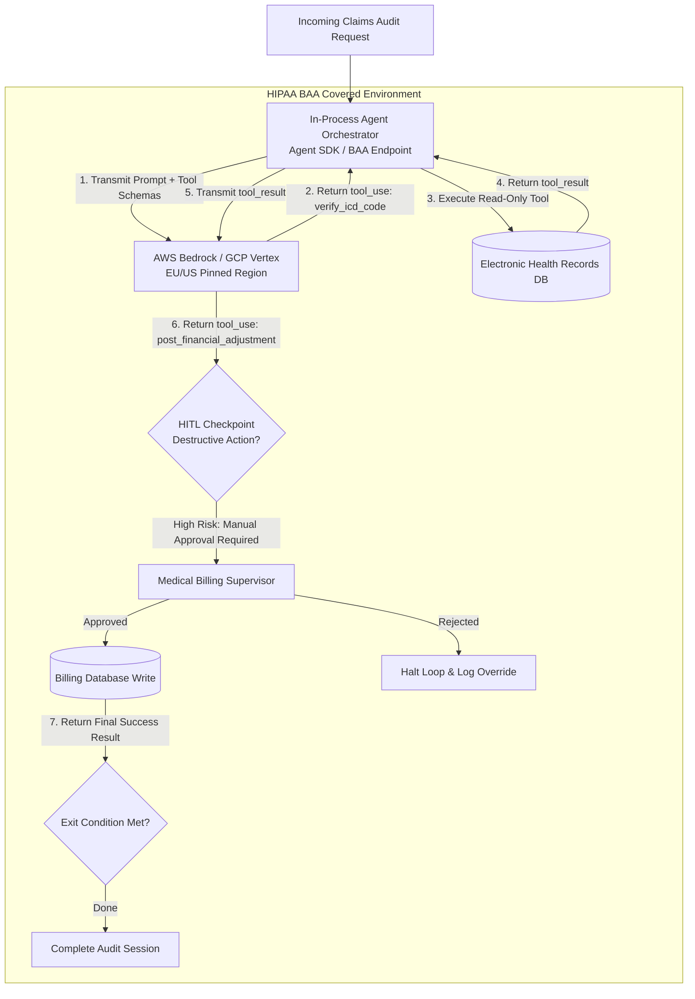

## [Building a production agent: the loop, wiring paths, orchestration, and human-in-the-loop](https://anthropic-partners.skilljar.com/path/claude-certified-developer-foundations/production-grade-prompting-agents-tool-use/486743/scorm/3k33sihfb1tww)

### 1. Problem Statement

Developers frequently default to building non-deterministic agent loops for tasks that can be fully enumerated in standard code, introducing unnecessary coordination overhead, cost, and failure surface area. Conversely, forcing rigid workflows on variable inputs leads to fragile systems. Furthermore, selecting runtime wiring paths without evaluating regulatory data constraints (such as HIPAA/PHI, ZDR, or FedRAMP) early in system design leads to non-compliant architectures that require total re-engineering prior to production.

---

### 2. Summary

* **Workflow vs. Agent Architectural Decision:**
  * **Choose a Workflow when:** Steps can be enumerated in code, execution sequences are fixed, inputs are well-constrained, strict step-level guardrails are required, and standard operational observability is mandatory.
  * **Choose an Agent when:** The goal and tools can be defined but the execution path cannot be enumerated in advance, user inputs vary unpredictably, non-determinism within tool boundaries is acceptable, and creative tool sequencing is required.

* **The Three Wiring Paths:**
1. **Raw Messages API Loop:** In-process loop where client code manages every iteration, tool call execution, state persistence, retries, and explicit exit conditions.
2. **Agent SDK:** In-process execution where the SDK manages loop orchestration, tool registration, and context handling while application code executes tool logic.
3. **Claude Managed Agents (Public Beta):** Server-side hosting where Anthropic runs the loop, execution sandbox, and stateful sessions while the client streams events. *Governing Constraint:* Server-side state storage renders Managed Agents **ineligible** for Zero Data Retention (ZDR) or HIPAA Business Associate Agreements (BAA).

* **The Four Immutable Agent Loop Invariants:**
  1. *Tool Registration:* Register explicit schemas matching model capabilities.
  2. *Scoped System Prompt:* Name the specific task and available tools; omit unused tools to avoid erratic routing.
  3. *Tool-Use Loop Execution:* Execute every `tool_use` block generated in an assistant turn and return corresponding `tool_result` blocks before the next turn.
  4. *Explicit Exit Conditions:* Define programmatic stopping criteria independent of Claude's decision to conclude turns.

* **Human-in-the-Loop (HITL) Checkpoints:** Insert review steps before destructive write/delete actions (High Risk), after initial plan generation (Medium Risk), or upon encountering unexpected tool errors.
* **Tool Orchestration:** Over-tooling degrades tool routing quality and inflates context; start with the minimum viable toolset required for the task.
* **Regulated Data Constraints & Endpoint Routing:**
  * **HIPAA (PHI):** Requires a dedicated BAA-covered Anthropic API organization or cloud-mediated routes (AWS Bedrock / GCP Vertex). BAA does *not* cover Console, Workbench, beta features (Managed Agents), or consumer plans.
  * **GDPR / Data Residency:** Direct Anthropic API does not offer EU data residency; applications requiring pinned geographic regions must route through AWS Bedrock or GCP Vertex.
  * **FedRAMP / Government:** Authorized routes are limited to Claude for Government (C4G via Palantir PFCS-SS), AWS Bedrock GovCloud (FedRAMP High & DoD IL4/5), and GCP Vertex AI Assured Workloads. *Claude Enterprise on AWS Marketplace is NOT FedRAMP authorized.*

---

### 3. Clear & Simple Explanation

Before writing code, ask whether your system actually needs an agent. If the steps can be written as standard `if/then` code logic, use a **Workflow**. Workflows are reliable, easy to trace, and cheap. Use an **Agent** only when the model must dynamically figure out *which* tools to use and in *what order* based on unpredictable user input.

When building an agent, you choose where the execution loop runs:

  * **Raw API / Agent SDK:** Runs inside your own infrastructure. You control every step, making it compliant with strict privacy requirements like HIPAA or Zero Data Retention.
  * **Claude Managed Agents:** Anthropic hosts the execution loop and environment for you. It simplifies multi-minute tasks, but because session state is stored server-side, it cannot be used for HIPAA PHI or zero-retention workloads.

Always set strict programmatic **exit conditions** so your agent doesn't run forever, and place **Human-in-the-Loop** checkpoints right before any irreversible operation (like sending an email or deleting a database record).

---

### 4. Real-World Application

**Scenario:** An Enterprise Healthcare Billing Audit & Claims Adjustment Agent operating in a HIPAA-regulated enterprise environment. The agent analyzes patient medical records, verifies ICD-10 diagnostic codes, and posts financial adjustments to the billing system.

**System Architecture & Workflow Diagram:**

**Implementation Details:**

1. **Endpoint Routing:** Routed via AWS Bedrock under an active HIPAA BAA with regional locking to ensure PHI compliance (avoiding non-BAA managed surfaces).
2. **HITL Intercept:** Read operations (`verify_icd_code`) execute automatically, but financial adjustments trigger a mandatory Human-in-the-Loop checkpoint before database commits.
3. **Exit Invariant:** A deterministic exit check verifies claim balance resolution before terminating the loop.

---

### 5. Key Terms Note Section

### Key Technical Terms

* **Workflow:** A deterministic software pattern where the sequence of execution steps and branching logic are explicitly enumerated in code.
* **Agent:** An autonomous execution pattern consisting of a multi-step tool-use loop with managed context, where tool selection and sequencing emerge from model reasoning over a defined goal.
* **Claude Managed Agents:** An Anthropic-hosted server-side agent runtime where the iteration loop, execution sandbox, and session state are managed as a versioned API resource.
* **Agent SDK:** An in-process client library that handles tool registration, context management, and iteration loops within the developer's application environment.
* **Human-in-the-Loop (HITL):** An architectural checkpoint that pauses agent execution to require human verification before proceeding, typically placed prior to destructive tool execution or following plan generation.
* **Business Associate Agreement (BAA):** A legal contract required under HIPAA governing the handling of Protected Health Information (PHI), which dictates eligible API deployment configurations.
* **Zero Data Retention (ZDR):** A security posture where API providers do not store prompt or completion data post-execution, ruling out stateful server-side managed agent services.
* **Over-Tooling:** The practice of registering excessive or overlapping tool definitions, which degrades model tool-routing accuracy and inflates context token costs.
* **Exit Condition:** A programmatic stopping criterion implemented in the agent loop to terminate processing when task goals are achieved or boundary conditions are met.

---

--- **Exam Practice** ---

1. A healthcare engineering team is designing an automated patient intake agent that handles Protected Health Information (PHI). The team wants to minimize infrastructure maintenance by adopting Claude Managed Agents. What governing architectural constraint applies to this selection?

* A) Claude Managed Agents can be used only if system prompt caching is set to ephemeral mode.
* B) Claude Managed Agents store stateful sessions server-side and are currently ineligible for HIPAA Business Associate Agreement (BAA) coverage, requiring the team to use the Agent SDK or a raw API loop on a covered configuration.
* C) Managed Agents automatically encrypt PHI, satisfying BAA requirements without requiring cloud-mediated routes.
* D) Managed Agents require local `stdio` process connectors, which violate HIPAA data transit standards.

---

2. An enterprise development team is evaluating whether to build a customer refund processor as a deterministic Workflow or an autonomous Agent. Which system requirement mandates choosing a Workflow over an Agent?

* A) The refund process requires creative sequencing of dynamic external tools based on unstructured customer complaints.
* B) The inputs vary unpredictably across unstructured media formats.
* C) The system must execute a strictly enumerated sequence of steps in code where error costs are high and step-level guardrails are mandatory.
* D) Non-determinism is acceptable provided tool schemas are strictly validated.

---

3. A lead systems architect must deploy a Claude-powered analysis pipeline for a federal government defense agency requiring FedRAMP High authorization. Which deployment route complies with this authorization requirement?

* A) Direct Anthropic Messages API using standard commercial credentials.
* B) Claude Enterprise purchased through the AWS Marketplace.
* C) Claude Managed Agents public beta endpoint configured with strict system prompts.
* D) Claude via Amazon Bedrock GovCloud or Claude for Government (C4G) via Palantir Federal Cloud Service.

---

4. During the execution of a custom agent loop built on the raw Messages API, Claude returns an assistant turn containing three separate `tool_use` blocks in a single payload. How must the client application handle these blocks to avoid API validation errors on the subsequent turn?

* A) Execute only the first `tool_use` block, discard the remaining two, and send a single `tool_result` block.
* B) Execute all three tool calls and return matching `tool_result` blocks for all three `tool_use` IDs within the immediately following user turn.
* C) Create three distinct user turns, appending one `tool_result` block per turn sequentially.
* D) Pass `disable_parallel_tool_use: true` in the subsequent user message turn to retroactively split the payload.

---

5. When designing Human-in-the-Loop (HITL) checkpoints within an autonomous financial agent framework, where should the primary HITL intercept point be placed to mitigate maximum organizational risk?

* A) Immediately before the execution of a destructive or irreversible write tool call, such as executing a wire transfer or database deletion.
* B) Immediately after every read-only tool call to verify data parsing formatting.
* C) Inside the system prompt definition prior to tool schema registration.
* D) Exclusively when the API returns `stop_reason: "max_tokens"`.

---

--- **Answer Key & Explanations** ---

1. **B** - Stateful session storage in Claude Managed Agents is maintained server-side by Anthropic, rendering it ineligible for Zero Data Retention (ZDR) or HIPAA BAA coverage. Healthcare workloads handling PHI must use the Agent SDK or a raw API loop configured on a BAA-covered organization (or cloud-mediated via Bedrock/Vertex).
2. **C** - Workflows are the correct architectural pattern when execution steps can be fully enumerated in code, inputs are known, and strict step-level guardrails are required. Agents should only be selected when execution paths cannot be enumerated in advance.
3. **D** - FedRAMP High authorization is maintained specifically through Claude via Amazon Bedrock GovCloud, Claude for Government (C4G via Palantir), or GCP Vertex AI Assured Workloads. Claude Enterprise on AWS Marketplace is explicitly noted as *not* FedRAMP authorized.
4. **B** - The Messages API invariant requires that *all* `tool_use` blocks issued in a single assistant turn must be executed and resolved with corresponding `tool_result` blocks in the *immediately following user turn*. Returning partial blocks or spreading results across multiple user turns causes API validation failures.
5. **A** - High-risk HITL checkpoints must be inserted directly before irreversible or destructive tool calls (such as writing payments, deleting data, or sending external communications) where an unverified agent action cannot be undone.
