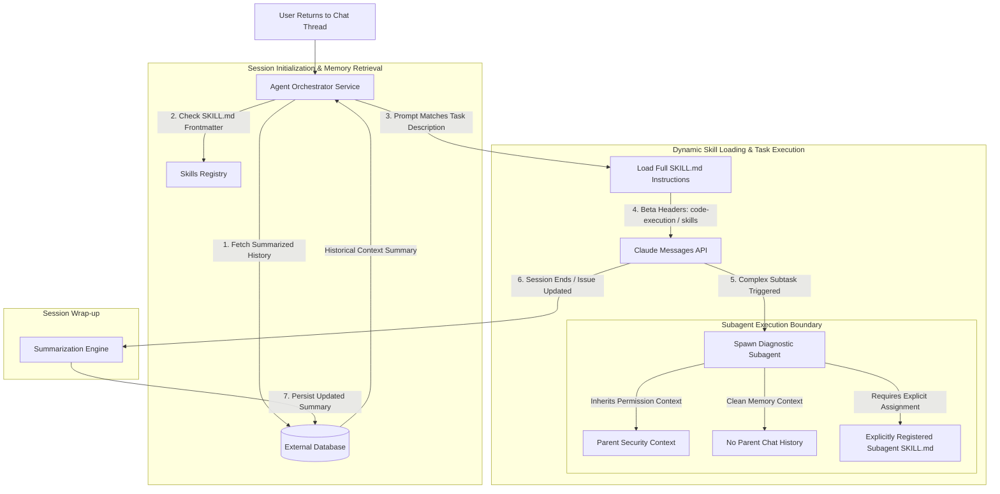

## [Choosing the right scope for state that survives sessions](https://anthropic-partners.skilljar.com/path/claude-certified-developer-foundations/production-grade-prompting-agents-tool-use/486743/scorm/3k33sihfb1tww)

### 1. Problem Statement

Agents operating strictly within a single session lose all accumulated context when that session terminates. Developers attempting to persist state face two conflicting failure modes: storing too much state in-context exponentially inflates token costs and latency across turns, while persisting too little state strips the agent of necessary memory across restarts. Furthermore, including broad, repeatable instruction sets in every prompt wastes context window budget on sessions where those instructions are never required.

---

### 2. Summary

* **Four Memory Scope Patterns:**
  * **In-Context Memory:** Keeps state in the active `messages` array during a single session. Delivers zero retrieval latency but incurs token costs that scale with session length; state is completely lost upon session restart.
  * **External Storage:** Writes state to an external database (SQL/NoSQL/Vector) and reads it back on demand or at session startup. Enables persistent memory across sessions, users, and agent instances at the cost of database query latency and added read/write code complexity.
  * **Summarized Memory:** Injects a condensed summary of prior interactions at session initialization. Reduces per-turn token costs for long-running workflows but drops any technical details omitted by the summarization prompt.
  * **Stateless (No Persistent Memory):** Retains zero state across turns or sessions. Has zero retrieval or token overhead; ideal for independent, single-task execution pipelines.

* **Design-Time vs. Production Refactor:** Memory architecture decisions must be made during initial agent design. Relying on growing in-context history causes token consumption and response latency to escalate until the agent hits hard context limits, forcing high-risk refactoring under production pressure.
* **On-Demand Instructions via Skills (`SKILL.md`):** A Skill is a reusable markdown file composed of frontmatter (`name`, `description`) and instruction content. Claude reads only the `description` at startup and loads full instructions into the context window on demand when a user request matches.
* **Skills vs. `CLAUDE.md` vs. In-Context:**
  * **`SKILL.md`:** On-demand task expertise; lowest startup context footprint.
  * **`CLAUDE.md`:** Unconditionally loaded into every session for always-on project rules (managed via `settingSources` in the Agent SDK).
  * **In-Context Instructions:** Ephemeral rules tied to a single session context.

* **Messages API Beta Integration & Subagent Constraints:**
  * Invoking Skills via the Messages API requires two beta headers: `code-execution-2025-08-25` and `skills-2025-10-02`. API-triggered Skills execute inside a remote code execution container rather than the host application environment.
  * **Subagent Inheritance Invariant:** Subagents start with a clean context window and do **not** automatically inherit Skills or conversation history from the parent session. However, subagents **do** inherit the parent session's permission context. Skills needed by a subagent must be explicitly declared in its configuration.

---

### 3. Clear & Simple Explanation

Choosing how an agent remembers information across conversations requires balancing cost, speed, and memory length:

* **Short-term memory (In-Context):** Great for single quick chats. It is fast, but sending the whole chat history back and forth gets expensive, and everything disappears when the window closes.
* **Long-term memory (External Storage):** Saves important facts to a database. It takes extra coding and adds slight database lookup delays, but allows the agent to remember users days or weeks later.
* **Condensed memory (Summarized):** Condenses past long chats into a quick cliff-notes summary. It saves context space, but risks forgetting minor specifics if the summarizer skips them.
* **No memory (Stateless):** Operates without memory between runs. Perfect for one-off automated jobs.

To give Claude specialized abilities without clogging every prompt with instructions, use **Skills**. A `SKILL.md` file acts like an indexed reference guide: Claude checks the title and description at the start, but only reads the full text if the user's prompt actually asks for that task.

When delegating tasks to **subagents**, remember that subagents inherit security permissions from the parent agent, but start with a blank context memory. If a subagent needs a specific Skill, you must register that Skill directly on the subagent.

---

### 4. Real-World Application

**Scenario:** An Enterprise IT Helpdesk & Technical Support Agent that manages multi-day ticket troubleshooting threads across multiple sessions and subtasks.

**Architecture Workflow Diagram:**

**Implementation Details:**

1. **Session Start:** The orchestrator queries an external SQL database to retrieve condensed user profile notes and ticket status, avoiding the high token cost of replaying historical raw logs.
2. **Skill Matching:** When the user asks to "parse VPN gateway logs," the agent matches the request against `SKILL.md` frontmatter descriptions and injects log-parsing instructions on demand.
3. **Subagent Delegation:** The agent delegates log analysis to a subagent. The subagent inherits the parent's API access permissions, but runs in a clean context window where the log-parsing Skill has been explicitly registered in its configuration.

---

### 5. Key Technical Terms

* **Memory Scope:** The architectural boundary determining what state persists across agent execution loops, how it is retrieved, and where it resides.
* **In-Context Memory:** Conversation state held inside the active `messages` payload during a single API session.
* **External Storage:** Database or persistent storage systems used to retain structured agent state across multiple sessions or user instances.
* **Summarized Memory:** An aggregated context layer created by running prior conversation turns through a compression prompt before injecting the result into a new session.
* **Stateless Execution:** An operational mode where an agent completes a task without reading, writing, or persisting state between invocations.
* **Skill (`SKILL.md`):** A reusable markdown instruction set with frontmatter (`name` and `description`) loaded dynamically into context only when a request matches its description.
* **`CLAUDE.md`:** A configuration file loaded unconditionally into every session to enforce global, always-on project constraints and standards.
* **`settingSources`:** An Agent SDK configuration property used to explicitly control which setting files (such as `CLAUDE.md`) are loaded into the agent environment.
* **Code Execution Container:** A sandboxed execution environment where Messages API Skills are executed when invoked using beta headers.
* **Permission Context Inheritance:** The security rule where subagents automatically inherit execution and tool permissions from the parent session while maintaining an isolated, clean conversation context.

---

--- **Exam Practice** ---

1. An enterprise development team is upgrading a customer support agent to handle multi-day troubleshooting workflows. The prototype currently passes the entire historical `messages` array on every API call. During extended sessions, latency increases significantly and token costs escalate. Which architectural refactoring strategy best resolves this cost and performance bottleneck while preserving cross-session continuity?

* A) Configure `CLAUDE.md` to load the complete message history unconditionally at session startup.
* B) Pass `cache_control: {"type": "ephemeral"}` on every individual message turn inside the live context array.
* C) Transition from pure in-context history to external storage or summarized memory, reading condensed context into new sessions on demand.
* D) Set `settingSources` to automatically clear all context blocks after every third turn.

---

2. An engineer needs to invoke task-specific Skills via the Anthropic Messages API. Which combination of beta HTTP headers and execution environment behavior applies to this implementation?

* A) Headers `code-execution-2025-08-25` and `skills-2025-10-02`; Skills execute inside a remote code execution container.
* B) Headers `mcp-client-2025-11-20` and `skills-v1`; Skills execute in the host application's local process space.
* C) Headers `skills-2025-10-02` and `agent-sdk-beta`; Skills run directly within the client's local `stdio` stream.
* D) Headers `ephemeral-skills-2025` and `container-v2`; Skills execute inside the local browser viewport context.

---

3. A principal AI architect is designing a multi-agent workflow where a parent coordinator agent delegates code refactoring tasks to a specialized subagent. What are the context and security inheritance rules governing this parent-to-subagent transition?

* A) The subagent automatically inherits all conversation history and loaded Skills from the parent, but resets its permission context to default.
* B) The subagent receives a clean context window without inherited conversation history or Skills, but automatically inherits the parent session's permission context.
* C) The subagent automatically inherits conversation history, loaded Skills, and permission context from the parent session.
* D) The subagent inherits `CLAUDE.md` settings and active Skills, but receives a completely isolated permission context with zero tool access.

---

4. When comparing `SKILL.md`, `CLAUDE.md`, and in-context system instructions for managing agent guidance, which statement correctly identifies their context loading mechanics?

* A) `SKILL.md` loads unconditionally into every session, whereas `CLAUDE.md` loads only when its frontmatter matches the user prompt.
* B) `CLAUDE.md` loads unconditionally into every session (subject to SDK configuration), whereas `SKILL.md` evaluates frontmatter descriptions at startup and loads full instructions only on demand.
* C) In-context system instructions survive session restarts, whereas `SKILL.md` instruction blocks are wiped upon every turn completion.
* D) `SKILL.md` requires zero context tokens at any point because instructions execute out-of-band on local database servers.

---

5. A developers team notices that an agent frequently drops specific bug tracking numbers and modified file paths whenever a session context compression step occurs. What is the root cause of this technical state loss?

* A) The Messages API automatically purges string identifiers during token serialization.
* B) `CLAUDE.md` was configured with `settingSources: false`, disabling string retention.
* C) The summarization prompt used for summarized memory was underspecified and failed to explicitly instruct the model to preserve critical technical variables.
* D) External storage databases automatically truncate non-numerical values during cross-session writes.

---

--- **Answer Key & Explanations** ---

1. **C** - Keeping all state in-context causes token consumption and latency to scale with every turn. Transitioning to external storage or summarized memory allows the agent to start new sessions with condensed historical context, eliminating the cost and context window bloat of re-sending full historical message arrays.
2. **A** - Invoking Skills via the Messages API requires the beta headers `code-execution-2025-08-25` and `skills-2025-10-02`. Skills invoked this way run inside a remote code execution container rather than the host application environment.
3. **B** - Subagents start with a clean context window (they do not inherit parent conversation history or loaded Skills, which must be explicitly configured on the subagent if required). However, subagents do inherit the permission context from the parent session.
4. **B** - `CLAUDE.md` acts as an always-on project standard that loads unconditionally into every session (controlled via `settingSources` in the Agent SDK). Conversely, a Skill (`SKILL.md`) only exposes its frontmatter description at startup and loads its full instruction body on demand when a request matches.
5. **C** - Summarized memory depends entirely on a well-specified summarizer prompt. If the compression prompt does not explicitly instruct the model to preserve specific state elements (such as modified file paths, decisions, or tracking IDs), the summarizer will treat them as non-essential prose and drop them during compaction.
