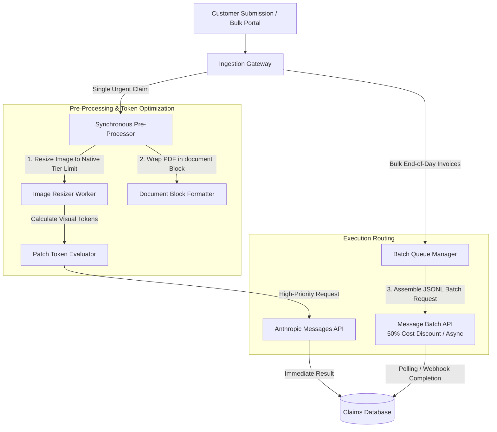

## [Images, PDFs, and high-volume processing](https://anthropic-partners.skilljar.com/path/claude-certified-developer-foundations/production-grade-prompting-agents-tool-use/486743/scorm/3k33sihfb1tww)

### 1. Problem Statement

Ingesting raw, unoptimized visual media (images, PDFs) or dispatching thousands of synchronous requests individually leads to context window bloat, extreme request payload latency, API rate-limit throttling, and unnecessary operational costs. Without upfront image pre-processing and asynchronous ingestion strategies, high-volume multimodal pipelines stall under scale.

---

### 2. Summary

* **Visual Token Calculation:** Images consume context window budget based on $28 \times 28$ pixel patch grids. The exact token cost is computed as:

$$\text{Visual Tokens} = \left\lceil \frac{\text{width}}{28} \right\rceil \times \left\lceil \frac{\text{height}}{28} \right\rceil$$

* **Resolution Scaling & Tier Limits:** Models enforce long-edge and visual-token caps. Oversized images are downscaled API-side prior to processing, but performing client-side resizing before ingestion reduces transport payload size and network latency.
* **Image Transport Mechanisms:**
    * **Inline Base64:** Encodes image bytes directly into message blocks. Introduces 33% string encoding bloat and re-transmits full payloads on every turn (best for single-turn, non-reusable images).
    * **Files API / URL References:** Stores images out-of-band to prevent multi-turn payload repetition.

* **PDF Ingestion via Document Blocks:** PDF processing uses the explicit `document` block type rather than `image`, handling native document layout, text extraction, and multi-page context formatting.
* **Message Batch API for High Volume:** Asynchronous batching handles thousands of non-real-time inputs without blocking application threads, operating under separate rate limits at a 50% cost reduction compared to standard synchronous Messages API calls.

---

### 3. Clear & Simple Explanation

When building multimodal AI applications, every visual asset consumes part of your context window budget before Claude reads a single word of your prompt:

* **Calculate visual costs first:** Claude splits images into $28 \times 28$ pixel square tiles. A $1,000 \times 1,000$ pixel image equals 1,296 visual tokens. Downscaling high-res images before sending them to the API takes minimal developer time but saves huge amounts of context space and money.
* **Choose the right upload path:** Base64 encoding puts the entire raw image inside the text payload. Use base64 only for quick, one-off images. If an image will be reused across conversation turns, use file references so you don't pay to upload the same bytes repeatedly.
* **Use Document Blocks for PDFs:** Pass PDF files using the `document` content block type rather than manually converting PDF pages into separate images.
* **Batch bulk requests:** For non-urgent workloads processing thousands of documents or images, do not send synchronous API requests one by one. Use the Message Batch API to run jobs asynchronously in the background at half the cost.

---

### 4. Real-World Application

**Scenario:** An Enterprise Insurance Claims & Receipt Audit Pipeline that processes tens of thousands of customer claim receipts, photos, and PDF policy forms daily.

**System Architecture & Workflow Diagram:**

**Implementation Highlights:**

1. **Pre-Ingestion Downscaling:** Incoming high-resolution claims photos (e.g., 12 Megapixels) are resized down to the model tier's native long-edge limit prior to base64 encoding, preventing unnecessary payload latency.
2. **Document Block Parsing:** Multi-page PDF policy agreements are formatted as `document` content blocks rather than rasterized page images.
3. **Batch Offloading:** End-of-day bulk receipt auditing is routed through the Message Batch API, processing out-of-band at half the cost without hitting standard synchronous rate limits.

---

### 5. Key Terms Note Section

### Key Technical Terms

* **Visual Token:** A unit of context window measurement corresponding to a single $28 \times 28$ pixel patch of an ingested image.
* **Base64 Encoding:** A binary-to-text encoding scheme used to embed raw image or document bytes directly within JSON message payloads.
* **Document Content Block:** A specialized API message block type (`type: "document"`) used to transmit PDF files and structured document formats to Claude.
* **Message Batch API:** An asynchronous endpoint designed for processing bulk requests out-of-band with dedicated rate limits and a 50% price reduction.
* **Downscaling:** The client-side or server-side process of reducing image pixel dimensions to fit within native model resolution and visual token caps.
* **Patch Grid:** The $28 \times 28$ pixel grid division applied across images to determine visual token consumption.
* **Files API:** A storage mechanism allowing developers to upload media files once and reference them across multiple API requests to avoid repeated transmission overhead.

---

--- **Exam Practice** ---

1. An engineer is building a visual document processing pipeline using Claude. Incoming images measure $560 \times 840$ pixels. Assuming the image fits within the model tier's native long-edge limits, how many visual tokens will this image consume in the context window?

* A) 300 visual tokens
* B) 1,296 visual tokens
* C) 600 visual tokens
* D) 1,680 visual tokens

---

2. A developer needs to pass an image into a multi-turn troubleshooting session that will span 15 turns. If the image is encoded as an Inline Base64 string inside the user message array on every turn, what is the architectural consequence?

* A) Request payload sizes and latency escalate dramatically because the full base64 string is re-transmitted on every single turn.
* B) The Messages API automatically converts the base64 string into a server-side cached URL after the first turn.
* C) The image visual token cost drops by 50% on subsequent turns due to automatic patch caching.
* D) The API rejects the request on turn 2 because base64 blocks are strictly limited to single-turn conversations.

---

3. When ingesting a multi-page PDF agreement into the Messages API, which content block type configuration should be used to pass the document natively?

* A) `type: "image"` with source type `"pdf_bytes"`
* B) `type: "file_vector"` with source type `"base64"`
* C) `type: "multimodal_page"` with source type `"document_url"`
* D) `type: "document"` with source type `"base64"` or location references

---

4. An enterprise team needs to process 100,000 customer feedback forms every night. The processing is non-real-time and must complete within 24 hours. Which API deployment strategy provides the highest throughput and lowest operational cost?

* A) Dispatching 100,000 synchronous Messages API requests across 50 concurrent worker threads.
* B) Assembling the inputs into JSONL batch files and submitting them to the Message Batch API.
* C) Converting all feedback forms into base64 strings and passing them inside a single extended-thinking prompt.
* D) Routing the requests through an agent loop using inline base64 image blocks.

---

5. A high-resolution camera feeds $4000 \times 3000$ pixel screenshots into an automated QA monitoring pipeline. What happens when an image exceeds the model tier's maximum long-edge native resolution limit?

* A) The API rejects the request with an `image_resolution_exceeded` HTTP 400 validation error.
* B) The model processes only the top-left $28 \times 28$ patch grid and truncates the rest of the image.
* C) The API downscales the image prior to processing, calculating visual tokens on the scaled dimensions.
* D) Extended thinking is automatically enabled to analyze the full-resolution image pixel-by-pixel.

---

--- **Answer Key & Explanations** ---

1. **C** - Using the visual token calculation formula $\lceil \text{width} / 28 \rceil \times \lceil \text{height} / 28 \rceil$: $\lceil 560 / 28 \rceil = 20$ and $\lceil 840 / 28 \rceil = 30$. Multiplying $20 \times 30 = 600$ visual tokens.
2. **A** - Inline Base64 encoding includes the full image payload directly inside the message block string. Re-sending this array on every turn re-transmits the large base64 payload over the network every time, increasing latency and network bloat.
3. **D** - For PDF files, the API requires the `document` content block type (`type: "document"`) rather than the `image` block type.
4. **B** - The Message Batch API is designed specifically for high-volume, non-real-time asynchronous workloads, offering separate rate limits and a 50% discount on token pricing compared to standard synchronous calls.
5. **C** - Images that exceed a model tier's native long-edge or visual-token limits are downscaled automatically by the API before processing, and token costs are calculated based on the scaled dimensions. Client-side pre-scaling is still recommended to reduce network payload transmission latency.
