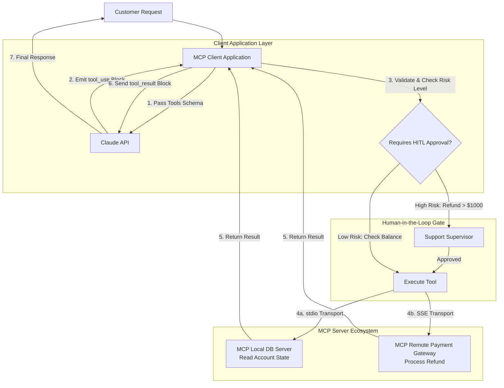

## [Model Context Protocol (MCP) and Tool Use Integration](https://www.google.com/search?q=https://anthropic-partners.skilljar.com/path/claude-certified-developer-foundations/mcp-and-tool-use/486743/scorm/mcp-tool-use)

### 1. Problem Statement

Integrating Large Language Models (LLMs) with custom internal databases, enterprise APIs, and local developer tools traditionally requires building bespoke, fragile integration wrappers for every service. 
As agent pipelines expand, managing unique payload transformations, connection transports, state synchronization, and security controls across heterogeneous
data sources becomes unmaintainable, insecure, and prone to breaking changes.

---

### 2. Summary

* **Model Context Protocol (MCP) Standard:** An open protocol created by Anthropic that establishes a client-server architecture to decouple LLM applications (MCP Clients) from external tools and context providers (MCP Servers).
* **Core MCP Primitives:**
  * **Tools:** Executable functions called by the model to perform side effects or calculations (e.g., running SQL queries, creating Jira tickets, executing code).
  * **Resources:** Read-only contextual data sources or URIs exposed to the client (e.g., log files, database schemas, application documents).
  * **Prompts:** Pre-configured prompt templates hosted on the server that standardize common task invocations.

* **Transport Mechanisms:**
  * **`stdio` Transport:** Standard input/output pipes used for local process-level communication between an MCP Client and a local MCP Server process.
  * **`SSE` (Server-Sent Events) Transport:** HTTP-based streaming protocol used for remote MCP Server instances across microservice networks.

* **Tool Use Execution Loop:**
  1. **Schema Definition:** Client passes available tools via `tools` array using JSON Schema definitions.
  2. **Invocation Decision:** Claude emits a `tool_use` content block containing the tool `name`, unique `id`, and argument parameters.
  3. **Execution:** Client invokes the tool via MCP or local execution.
  4. **Feedback Loop:** Client returns a `tool_result` content block referencing the original `tool_use_id` back to Claude inside a `user` role message.

* **Security & Human-in-the-Loop (HITL):** Tool invocation is non-deterministic. The host application acts as a gatekeeper between Claude and external execution environments, allowing developers to inspect `tool_use` inputs, enforce role-based access control (RBAC), and insert human verification before execution.

---

### 3. Clear & Simple Explanation

The **Model Context Protocol (MCP)** functions like a universal USB-C port for AI models. Instead of writing custom code every time Claude needs to connect to a new database or API, MCP provides a standard plug-and-play architecture:

* **MCP Server:** A small service that sits in front of a data source or tool (like Postgres, GitHub, or a payment system). It advertises what it can do using **Tools** (actions), **Resources** (read-only data), and **Prompts** (templates).
* **MCP Client:** Your core application hosting Claude. It connects to one or more MCP Servers, collects their capabilities, and presents them to Claude.
* **Tool Loop:** Claude never directly accesses your database or runs tools. When Claude wants to run a tool, it pauses generation and sends a structured request (`tool_use`). Your application executes the tool via the MCP Server, gets the response, and sends it back to Claude (`tool_result`) so Claude can resume its answer.
* **Human Control:** Because your application controls the execution step, you can pause execution to ask a human manager for approval before high-risk actions (like transferring money or deleting files) are allowed to run.

---

### 4. Real-World Application

**Scenario:** An Automated Payment & Support Service where Claude processes customer refunds, queries account balances, and updates subscription tiers.

**Architecture Workflow Diagram:**

**Implementation Details:**

1. **Schema Discovery:** The Client discovers local DB tools over `stdio` and remote Payment APIs over `SSE` via MCP server manifests.
2. **Execution Inspection:** When Claude requests `issue_refund(amount: 1200)`, the Client's policy engine catches the high value and pauses execution for human supervisor approval.
3. **State Feedback:** Upon approval, the client calls the Remote Payment MCP Server, formats the result into a `tool_result` block, and sends it back to Claude to formulate a polite response.

---

### 5. Key Terms Note Section

### Key Technical Terms

* **Model Context Protocol (MCP):** An open standard defining client-server communications between LLM applications and external data tools.
* **MCP Client:** The host application that connects to MCP servers, manages the Claude API context window, and executes tool calls.
* **MCP Server:** An independent service exposing capabilities (tools, resources, prompts) to an MCP client via standardized transports.
* **`tool_use` Block:** A specialized content block emitted by Claude specifying the `name`, `id`, and input parameters of a tool it wants to execute.
* **`tool_result` Block:** A content block sent by the application back to Claude containing the string or JSON output (or error details) of a tool execution.
* **JSON Schema:** A declarative structure used to define tool parameter types, descriptions, and required fields for Claude.
* **`stdio` Transport:** An IPC transport mechanism using standard input and output streams for local process communication.
* **`SSE` (Server-Sent Events) Transport:** An HTTP-based transport mechanism enabling remote streaming communication between MCP clients and servers.
* **Human-in-the-Loop (HITL):** A safety architecture pattern where critical tool execution calls are intercepted for manual approval before proceeding.

---

--- **Exam Practice** ---

1. An engineer needs to expose a read-only PostgreSQL database schema and live application telemetry logs to Claude through an MCP server without allowing the model to perform write operations. Which MCP primitive should be implemented?

* A) Tools
* B) Prompts
* C) Resources
* D) Subagents

---

2. During a multi-turn tool calling sequence, Claude emits a `tool_use` block with `id: "tool_call_9987"`. What is the mandatory format required for sending the execution output back to Claude in the subsequent request turn?

* A) A `user` role message containing a `tool_result` content block matching `tool_use_id: "tool_call_9987"`.
* B) An `assistant` role message containing a `tool_response` content block with `status: "completed"`.
* C) A `system` role prompt injection appending the raw execution payload string.
* D) A direct HTTP POST to the Anthropic tool execution endpoint bypassing the `messages` payload array.

---

3. A distributed system architecture requires an MCP Client running on a Kubernetes cluster to interact with an MCP Server hosted on a distinct microservices endpoint. Which transport protocol must be configured?

* A) Standard input/output pipe (`stdio`)
* B) Shared memory buffer (`ipc_shm`)
* C) Direct WebAssembly memory interface (`wasm_mem`)
* D) Server-Sent Events over HTTP/HTTPS (`SSE`)

---

4. An enterprise financial application requires explicit supervisor authorization before executing any tool that performs bank transfers exceeding $5,000. Where should this Human-in-the-Loop (HITL) interception logic be implemented?

* A) Embedded directly inside the tool's JSON Schema parameter rules under `authorization_level`.
* B) Within the MCP Client application layer after intercepting the `tool_use` block emitted by Claude.
* C) Inside the Anthropic API proxy server prior to returning tokens to the client.
* D) Inside the MCP Server's internal transport protocol listener before accepting requests.

---

5. When an external API tool call fails due to a network timeout during execution, how should the application communicate this failure back to Claude to enable graceful error recovery?

* A) Return a `user` role message containing a `tool_result` block with `is_error: true` and details in the `content`.
* B) Throw a non-retryable HTTP 500 error directly to the Anthropic Messages API client SDK.
* C) Delete the corresponding `tool_use` block from conversation history and re-issue the initial prompt.
* D) Append a system message stating `API_CALL_FAILED` and reset the context window session.

---

--- **Answer Key & Explanations** ---

1. **C** - Resources are the MCP primitive specifically designed to expose read-only contextual data, files, schemas, and logs to the client without enabling write actions or side effects (which are handled by Tools).
2. **A** - Tool results must be sent as a `user` role message containing a `tool_result` block where `tool_use_id` matches the `id` of the original `tool_use` block provided by Claude.
3. **D** - `SSE` (Server-Sent Events) over HTTP/HTTPS is the standardized MCP transport protocol designed for remote, cross-network microservice communication, whereas `stdio` is strictly for local process IPC.
4. **B** - The MCP Client application acts as the orchestration layer and security gatekeeper. It intercepts `tool_use` blocks emitted by Claude, validates the arguments against business policies, and pauses execution for human approval before calling the MCP Server.
5. **A** - Tool execution errors should be returned inside the `tool_result` block with `is_error: true`. This allows Claude to inspect the error details and attempt self-correction, such as retrying with modified parameters or explaining the failure to the user.
